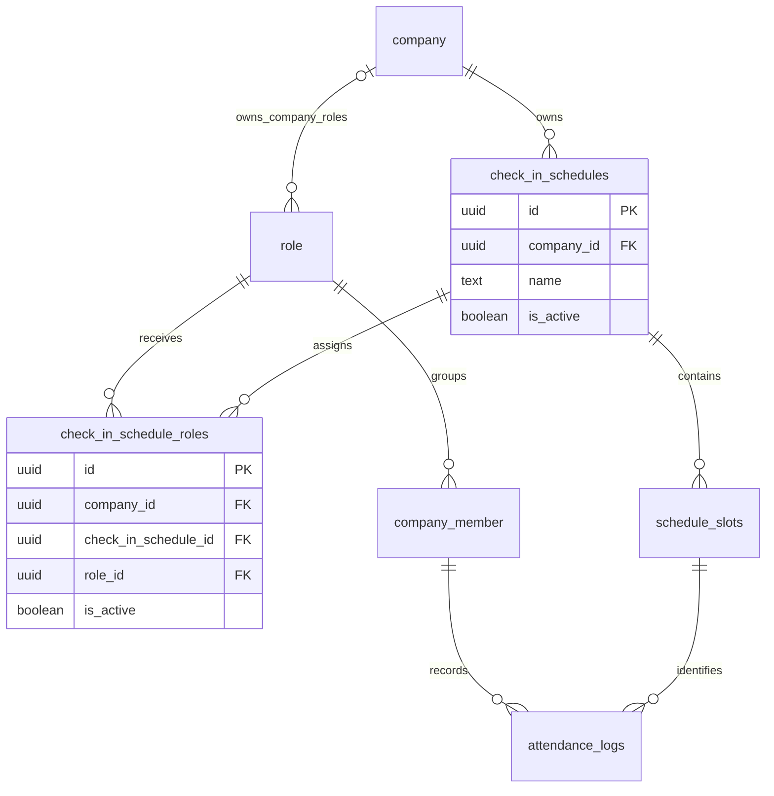

# Check-in Schedule × Role — Many-to-many

สถานะ: **Implement แล้ว 2026-09-12** ครอบคลุม Domain, Drizzle, Application, Infrastructure, API/SDK และ UI; [erDiagram.dbml](../erDiagram.dbml) อัปเดตตาม implementation

หนึ่ง Role มีได้หลาย Schedule และหนึ่ง Schedule มอบหมายได้หลาย Role โดยเพิ่มตารางกลาง `check_in_schedule_roles` ส่วนรอบเช็คอิน (`schedule_slots`) ยังเป็นของ Schedule และบันทึก (`attendance_logs`) ยังแยกตามสมาชิก × Slot × วัน

Role ของบริษัทอ้างอิง company ส่วน Role กลางมี company_id เป็น NULL; ผู้ใช้ยืนยันให้คงการใช้งาน system default Role เดิมเมื่อ 2026-09-12

## ตารางและข้อบังคับ

| ตาราง                     | การเปลี่ยนแปลง                                                                                                          |
| ------------------------- | ----------------------------------------------------------------------------------------------------------------------- |
| `check_in_schedules`      | เอา `role_id` และ unique เดิมออก เก็บบริษัท ชื่อ และสถานะเปิดใช้งาน เพิ่ม unique `(id, company_id)` สำหรับ composite FK |
| `check_in_schedule_roles` | เพิ่ม `id`, `company_id`, `check_in_schedule_id`, `role_id`, `is_active`, `created_at`, `updated_at`                    |
| `role`                    | ใช้โครงสร้างเดิม รองรับ Role ของบริษัทและ system default Role กลาง; สมาชิกยังมี Role เดียว                              |
| `schedule_slots`          | ใช้โครงสร้างเดิม ลำดับ Slot ไม่ซ้ำภายใน Schedule                                                                        |
| `attendance_logs`         | ใช้โครงสร้างเดิม unique `(company_member_id, schedule_slot_id, work_date)` กันเช็คซ้ำต่อ Slot ต่อวัน                    |

- Unique `(check_in_schedule_id, role_id)` กันมอบหมายคู่เดิมซ้ำ รวมแถวที่ปิดใช้งานแล้วด้วย หากต้องการใช้ใหม่ให้เปิดแถวเดิม
- Composite FK `(check_in_schedule_id, company_id)` บังคับ assignment ให้เป็นของบริษัทเดียวกับ Schedule โดย `company_id` ในตารางกลางห้ามเป็น NULL
- FK `role_id → role.id` รองรับ Role กลางที่ `company_id IS NULL`; use case อนุญาตเฉพาะ Role บริษัทเดียวกัน หรือ Role กลางที่ `is_system_default = true` ห้าม Role ของบริษัทอื่น ข้อนี้ตรวจใน application เพราะ FK เดี่ยวไม่บังคับบริษัทของ Role
- การอ่าน Schedule ตาม Role ต้องระบุบริษัท และการเช็คอินอิงบริษัท/Role ของสมาชิกจริง จึงไม่เปิด Schedule ข้ามบริษัทแม้ใช้ Role กลางเดียวกัน
- Schedule สร้างไว้ก่อนโดยยังไม่มอบหมาย Role ได้ การปิด Schedule มีผลต่อทุก Role; การปิด assignment มีผลเฉพาะคู่ที่เลือก

## ตัวอย่างการมอบหมาย

| Schedule        | Role    |
| --------------- | ------- |
| รอบประจำวัน     | แม่บ้าน |
| รอบประจำวัน     | รปภ.    |
| รอบตรวจช่วงเย็น | รปภ.    |

Role รปภ. ได้ 2 Schedules และ Schedule รอบประจำวันใช้ร่วมกัน 2 Roles สมาชิกแต่ละคนยังมีบันทึกเช็คอินของตนเอง

## พฤติกรรมที่เสนอสำหรับ MVP

**สมมติฐาน: ทุก Schedule ที่เปิดใช้งานและมอบหมายให้ Role มีผลร่วมกันทุกวัน** การมีหลาย Schedule ไม่ได้หมายถึงเลือกทำเพียง Schedule เดียว หากต้องการสลับกะตามวันจะต้องออกแบบกติกาวันที่เพิ่มเติม

1. อ่านสมาชิก active ในบริษัทที่เลือก แล้วค้นหา assignments ของ `company_id + member.role_id` ที่เปิดใช้งาน พร้อม Schedule ที่เปิดใช้งาน
2. แสดง Schedules ทั้งหมดพร้อม Slots โดยจัดกลุ่มตามชื่อ Schedule; สมาชิกเช็คอินแยกแต่ละ Slot ตาม `is_required` เดิม
3. ส่ง `scheduleSlotId` ที่เลือกอย่างชัดเจน หากมีหลายรอบที่เลือกได้ ห้ามเลือก Schedule แรกโดยอัตโนมัติ
4. ฝั่ง server ตรวจว่า Slot อยู่ใน Schedule ที่ active และยังมอบหมายให้ Role ปัจจุบันในบริษัทเดียวกันก่อนบันทึก รวมถึงเส้นทางบันทึกแทนโดยผู้มีสิทธิ์
5. Slot ที่เวลาทับกันคนละ Schedule ถือเป็นคนละรอบและมี log แยกกัน; ไม่รวมรอบจากชื่อหรือเวลาเดียวกัน การแก้ Slots ของ Schedule ที่แชร์มีผลต่อทุก Role ที่ได้รับ Schedule นั้น
6. ใช้กติกาเวลาและสถานะเดิม รวมถึงวันที่ทำงานตาม Asia/Bangkok; การเปลี่ยน M:N ไม่เปลี่ยนวิธีตัดสิน present/late

ปิด assignment หรือเปลี่ยน Role แล้ว log เดิมยังอยู่ และยังอ่านย้อนผ่าน Slot → Schedule ได้ โดยการอ่านประวัติใช้สิทธิ์อ่านของบริษัท/สมาชิก ไม่ผูกกับ assignment ปัจจุบัน อย่างไรก็ตาม log เดิมไม่ได้ snapshot Role หรือค่าของ Slot ณ เวลาเช็คอิน จึงยังใช้พิสูจน์ Role เดิมหรือสร้างรายการที่ควรเช็คย้อนหลังหลังเปลี่ยนการมอบหมายไม่ได้

การลบ Schedule ยังติด `restrict` หาก Slots มี attendance logs ตาม FK เดิม ให้ปิดใช้งานแทน ส่วนการลบ assignment ไม่ได้ลบ logs เพราะ logs ไม่อ้างอิงตารางกลาง

## Implementation

- Database: เพิ่มตารางกลางและ composite FK ของ Schedule; เปลี่ยน relations จาก Role → Schedule เดียว เป็น Role → assignments → Schedules
- Domain / API: เปลี่ยนการอ่าน Schedule ตาม Role จากรายการเดียวเป็น array ที่ scope บริษัท; แยกข้อมูล Schedule ออกจากการมอบหมาย Role
- Use case: ยกเลิกข้อห้ามสร้าง Schedule ซ้ำต่อ Role เปลี่ยนเป็นตรวจคู่ Schedule/Role ซ้ำ และตรวจ Slot ผ่าน assignment ตอนเช็คอิน
- UI: หน้าจัดการ Schedule เลือกหลาย Role ได้; หน้าเช็คอินรองรับหลาย Schedules พร้อมชื่อ Schedule และ Slot

## Migration และการติดตั้ง

1. ตรวจ Schedule เดิมทุกแถวว่า Role มีอยู่และเป็น Role ที่อนุญาต ยอมรับ system default Role กลางด้วย หาก Role อยู่บริษัทอื่นหรือเป็น global ที่ไม่ใช่ system default ให้หยุดโดยไม่ข้ามแถวเงียบ ๆ
2. เพิ่ม unique keys ของตารางแม่และตารางกลาง โดยยังเก็บ `check_in_schedules.role_id` เดิมไว้
3. ย้ายแต่ละ Schedule เป็น assignment หนึ่งแถวโดยใช้ Role เดิม และ `is_active = true`; Schedule ที่เคยปิดยังคงปิดผ่านสถานะของ Schedule
4. ตรวจว่าทุก Schedule เดิมมีคู่ assignment ครบและไม่ซ้ำ โดยไม่เปลี่ยน Schedule ID, Slot ID หรือ log เดิม
5. Migration ลบ `role_id` และ unique เดิมใน transaction เดียวกับ backfill; ระหว่าง cutover ให้หยุด API รุ่นเดิม แล้วเปิด API/UI รุ่นใหม่หลัง migration สำเร็จ

Migration: `packages/database/drizzle/20260912040000_check_in_schedule_roles/migration.sql`

รัน `npm run db:migrate --workspace @repo/database` ระหว่างหยุดการเขียนของ API รุ่นเดิม แล้วเปิด API/UI รุ่นใหม่พร้อมกัน เพราะ endpoint และ payload เปลี่ยนแบบ breaking change:

- `GET /attendances/companies/{companyId}/roles/{roleId}/schedules` คืน array ของ Schedule ที่ active และ assignment active
- Create/Update Schedule ใช้ `roleIds: string[]` เป็นชุด Role ที่เปิดใช้งาน; `[]` ปิดทุก assignment, ไม่ส่ง `roleIds` ใน Update หมายถึงไม่แก้การมอบหมาย
- Update Schedule ไม่รับ `companyId`; Update Slot ไม่รับ `checkInScheduleId`
- `POST /attendances/check-in` ต้องส่ง `scheduleSlotId`; บันทึกแทนผ่าน manual-check-in เท่านั้น
- อนุมัติการลาจะสร้างสถานะ excused ครบทุกรอบของทุก Schedule ที่ได้รับมอบหมาย

รัน migration บน local PostgreSQL แล้ว โดย Schedule เดิมที่ใช้ system default Member ยังคง Role เดิม สมาชิก/Slot/log เดิมไม่ถูกย้ายหรือเปลี่ยน ID

## การตรวจสอบ

- PostgreSQL integration test สร้าง schema แยก ทดสอบ migration, legacy global Role, M:N lookup, ปิด/เปิด assignment เดิม, rollback การเขียน และการคง log เดิม แล้วลบ schema ทดสอบ
- Application tests ตรวจการเลือก Slot จาก Schedule ที่สอง การจำกัดบริษัท/สมาชิก/Role และการไม่เปลี่ยน isActive/isRequired เมื่อแก้เฉพาะ field อื่น
- Types และ lint ผ่าน (มี warnings เดิม); Attendance cache invalidation tests ผ่าน
- ชุด test รวมมี 11 failures ใน Form mutation harness เดิม เช่นตัวแปร templateId/submissionId ไม่มีใน fixture ไม่เกี่ยวกับ Attendance

- ตรวจผ่าน browser ด้วยบัญชีและบริษัททดสอบ local: สร้าง Schedule สอง Role, แก้การมอบหมาย, แสดงสอง Schedules, เช็คอิน Schedule ที่สอง, และลงเวลาแทนพร้อมล้าง Slot เมื่อเปลี่ยน Schedule
- Authenticated API ตรวจข้อมูลจาก UI, ปฏิเสธบริษัท/Slot ที่ไม่อนุญาต, กันเช็คอินซ้ำ และคงประวัติหลังปิด assignment
