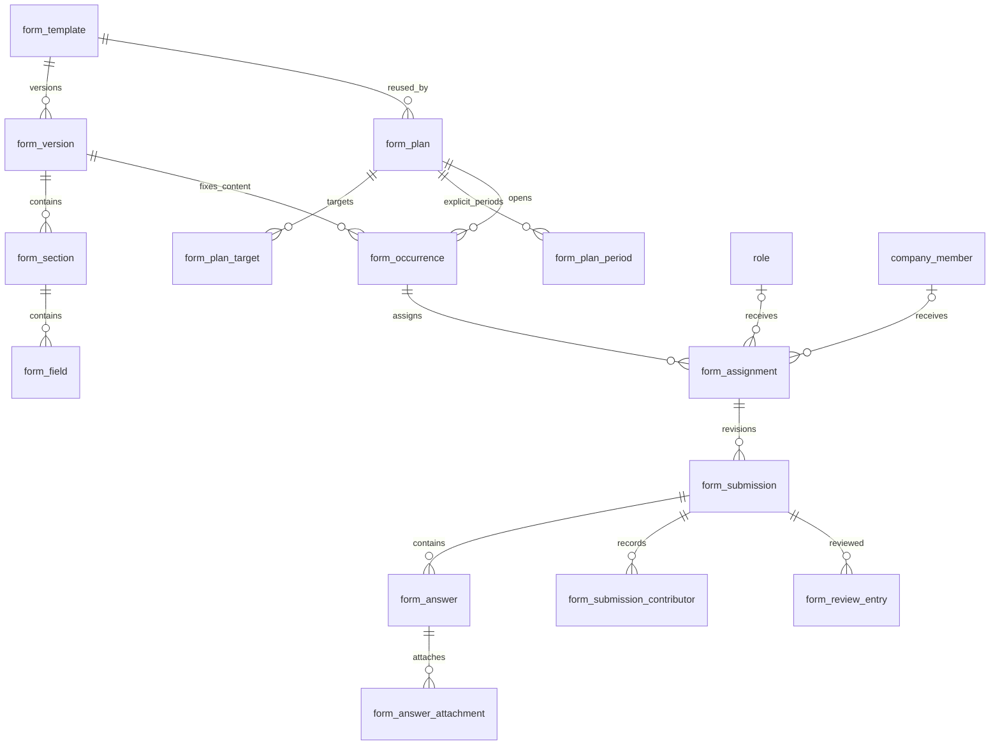
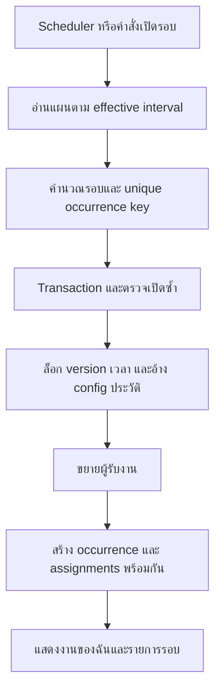

# Forms: แผนงาน การมอบหมาย และการตรวจ — แบบเสนอ

อ้างอิงโครงสร้างล่าสุด: [ERD (DBML)](../erDiagram.dbml) และ [คำอธิบาย ERD ภาษาไทย](erd-description-th.md) — แบบเสนอ ยังไม่ใช่ runtime schema

สถานะ: **Proposed — 2026-09-15** เอกสารออกแบบใหม่สำหรับการพัฒนา ไม่ใช่ความสามารถ runtime ที่เสร็จแล้ว อัปเดต proposed DBML แล้ว แต่ไม่เปลี่ยน runtime schema, migration หรือข้อมูลจริง สามารถ reset ชุดข้อมูลพัฒนาเมื่อเข้าสู่ขั้น implementation ได้ โดยไม่ต้องรักษา flow เดิม แต่ห้าม reset ข้อมูล production หรือข้อมูลที่ไม่ทราบเจ้าของโดยอนุมานเอง

เอกสารหลักนี้แทนข้อเสนอ Form เดิมใน [inspection-form-design.md](inspection-form-design.md) สำหรับงานรุ่นถัดไป อ่านคู่กับ [UI และ frontend data flow](form-workflow-ui-flow.md), [แผนพัฒนา](form-workflow-development-plan.md) และ [storage audit](erd-storage-audit.md)

## 1. ขอบเขตและหลักการ

- Form ใช้ซ้ำผ่านแผนรายวัน สัปดาห์ เดือน ไตรมาส ปี ครั้งเดียว หรือหลายช่วงเวลาที่กำหนดเอง
- ผู้รับงานเป็น Role ร่วมทำ หรือ company member รายบุคคล เลือก Role เพื่อแจกคนละงานได้
- แต่ละ tenant ตั้ง Role/Permission เอง ผู้ตรวจไม่ถูกบังคับเป็น Owner หรือตำแหน่งใด
- ตรวจข้อ หมวด และทั้งชุดได้ ขอแก้ภาพไม่ชัดพร้อม comment ได้
- รายการ Form เป็นตาราง คลิกชื่อไปหน้ารายละเอียดเพื่อแก้คำถาม จัดแผน และติดตามงาน
- ไม่สร้าง workflow engine, approval voting, reviewer assignment, discussion thread, AI ตรวจภาพ หรือ notification engine ในขอบเขตแรก
- เก็บ source facts, business decisions และ historical inputs ตาม AGENTS.md เท่านั้น

## 2. ภาพรวมและ ERD เชิงแนวคิด

Mermaid นี้สรุปความสัมพันธ์ ส่วน canonical DBML อัปเดตเป็นแบบเสนอเดียวกันแล้ว พร้อมคำอธิบาย constraints ที่ต้องเพิ่มใน migration ในเอกสาร ERD ภาษาไทย

## 3. ข้อมูลขั้นต่ำและเหตุผลการเก็บ

| ตาราง                                     | ข้อมูล/หน้าที่หลัก                                                                                                                                                                       |
| ----------------------------------------- | ---------------------------------------------------------------------------------------------------------------------------------------------------------------------------------------- |
| form_template / version / section / field | ใช้โครงสร้างคำถามเดิม Published content immutable; แก้โดย clone version                                                                                                                  |
| form_plan                                 | template, ชื่อแผน, effective interval decision, schedule config, timezone, effective start/end, version selection, review mode, late submission และ missed-run policy, concurrency token |
| form_plan_target                          | plan, role_id XOR company_member_id; role_distribution = SHARED/PER_MEMBER เฉพาะ Role                                                                                                    |
| form_plan_period                          | plan, เปิดเมื่อไรและ due เมื่อไร สำหรับครั้งเดียว/หลายช่วง explicit; ไม่ปนกับ recurring rule                                                                                             |
| form_occurrence                           | plan, occurrence_key, fixed version, actual open/due instants, อ้าง policy ผ่าน plan config ประวัติ, created_at, cancellation facts                                                      |
| form_assignment                           | occurrence, role_id XOR company_member_id, created_at คือเวลามอบหมาย, cancellation facts; ผู้สั่งเปลี่ยน/ยกเลิกจริงเมื่อมี manual action                                                 |
| form_submission                           | assignment, supersedes_submission_id, started_by, submitted_by/at, concurrency token เดิม; content ของ revision ที่ส่งแล้ว immutable                                                     |
| form_review_entry                         | submission, answer_id หรือ section_id หรือไม่มีทั้งคู่, action, note, actor, created_at, supersedes_entry_id                                                                             |
| answer / attachment / contributor         | ใช้ต่อ; เก็บผู้กรอกจริงและหลักฐานไฟล์เดิมเมื่อมีรอบแก้ไข                                                                                                                                 |

กำหนด company_id และ composite FK เท่าที่จำเป็นบังคับ tenant integrity ทุกความสัมพันธ์ ไม่ใช่เพื่อ cache การแสดงผล ไม่เพิ่ม template/version FK ในตารางลูกซ้ำ เว้นแต่จำเป็นเพื่อ FK integrity และต้องระบุเหตุผลใน DBML

ไม่เพิ่ม form_review แบบ 1:1, ไม่เก็บ target_type ซ้ำ, เลิก form_template_role สำหรับสิทธิ์กรอก และแทน submission_review เดิมด้วย review entry เมื่อ implement จริง

Occurrence เก็บ version และเวลาเปิด/กำหนดส่งจริง ส่วน review/late policy อ่านจาก plan config ประวัติที่ล็อกไว้ ไม่คัดลอก policy ซ้ำลงรอบงาน Assignment เก็บผู้รับจริงโดยเฉพาะเมื่อแจกจากสมาชิก Role ที่เปลี่ยนภายหลัง ไม่เก็บ derived status/count/progress/overdue/permission cache/next_run_at แบบ persistent; preview และ dashboard คำนวณตอนอ่าน

ผู้มอบหมายอัตโนมัติแสดงว่า “จากแผน …” ไม่แต่ง member actor ให้ scheduler; เก็บ actor ที่สร้าง/แก้ plan เป็นข้อมูลจริง ไม่อ้างว่า creator เป็นผู้สั่งทุกรอบด้วยตนเอง

## 4. การตั้งค่าที่ tenant ปรับได้

Permissions มี stable action codes ระบบรองรับ ผู้ใช้ tenant เลือกว่า Role ใดได้สิทธิ์ใด ไม่สร้าง arbitrary executable policy จากข้อความ

| ระดับ            | ตัวเลือก                                                                                      |
| ---------------- | --------------------------------------------------------------------------------------------- |
| Role permissions | จัดการ Form/plan, อ่านงาน, กรอก/ส่ง, ตรวจข้อ, ตรวจหมวด, ตัดสินชุด, ตรวจงานตนเอง               |
| Plan schedule    | DAILY/WEEKLY/MONTHLY/YEARLY + interval; quarterly = MONTHLY interval 3; หรือ explicit periods |
| Plan targets     | Role SHARED, Role PER_MEMBER, member                                                          |
| Plan version     | FIXED version หรือ LATEST_PUBLISHED เมื่อเปิดรอบ                                              |
| Plan review      | NONE / OVERALL / ALL_SECTIONS / ALL_ANSWERS                                                   |
| Plan timing      | timezone IANA, invalid-month-day SKIP/LAST_DAY, late ALLOW/DENY, missed run SKIP/CATCH_UP     |

ค่าเสนอเริ่มต้น: review OVERALL, late DENY, missed SKIP, invalid-month-day LAST_DAY และไม่ให้ self-review permission โดยปริยาย ค่าเหล่านี้เป็น implementation defaults ที่ปรับได้ ไม่ใช่ข้อบังคับตายตัวของ tenant

ไม่มีตาราง tenant defaults ในรุ่นแรก หากเพิ่มภายหลังให้ใช้เติมตอนสร้าง plan ไม่เปลี่ยนงานเก่าตาม defaults โดยอัตโนมัติ

## 5. ตารางเวลาและ lifecycle แผน

1. สร้าง Form draft และ publish ก่อนเปิดใช้แผน
2. ตั้ง local start date/time, timezone, interval และ weekday/day/month ที่เกี่ยวข้อง
3. กำหนด due offset เป็นจำนวนและหน่วยที่ชัดเจน (นาที/ชั่วโมง elapsed หรือวันตามปฏิทิน local) นี่เป็น policy input ไม่ใช่ duration ที่ derive จาก timestamps
4. API preview ใช้ calculator เดียวกับ scheduler แสดงรอบถัดไป 5–10 รอบ และ due เป็นเวลาท้องถิ่น
5. explicit periods บันทึกช่วงเปิด/ครบกำหนดเอง ต้อง open < due; รอบซ้อนกันอนุญาตเพราะอาจเป็นงานต่างครั้ง แต่ UI เตือนให้ตรวจดู
6. เสนอ DST policy คงที่: เวลาที่ไม่มีอยู่เลื่อนไป instant ที่ใช้ได้ถัดไป เวลาซ้ำเลือกครั้งแรก; ต้องมี tests ก่อนรองรับ timezone นั้น
7. บันทึกแผนและ targets ใน transaction; activate ได้เมื่อมี published version และเป้าหมายที่ใช้ได้
8. แก้ plan มีผลเฉพาะรอบที่ยังไม่เปิด และ effective time ห้ามย้อนหลังเพื่อสร้างงานจากกติกาใหม่แทนประวัติเก่า
9. สำหรับ recurring plan หากแก้ตาราง ให้ปิด effective interval เดิมและสร้าง successor plan configuration เพื่อเก็บ historical inputs ของรอบที่พลาด; ใช้ supersedes_plan_id และ UI แสดงเป็นประวัติแผนเดียว ไม่สร้าง plan-version table เพิ่ม
10. Pause ป้องกันเปิดรอบในช่วงหยุด; resume เริ่มจากเวลาที่เปิดใช้อีกครั้ง ไม่ backfill ช่วงที่ตั้งใจ pause. เก็บช่วง effective ของการใช้งานด้วย successor configuration เช่นกัน
11. Archive Form ป้องกันสร้างแผน/รอบใหม่ งานที่เปิดแล้วทำต่อได้ เว้นแต่ยกเลิกอย่างชัดเจน

## 6. เปิดรอบและสร้าง Assignment

- Unique (company, plan configuration, occurrence_key); key มาจากรอบ nominal local พร้อม timezone/offset หรือ period ID ไม่ใช่เวลาที่ worker รัน
- Target Role SHARED สร้างงาน Role หนึ่งรายการ สมาชิก active ปัจจุบันที่มีสิทธิ์ร่วมกรอกได้
- Target PER_MEMBER อ่านสมาชิก active ตอนเปิดจริงแล้วสร้างงานรายคน เก็บรายชื่อจริง ไม่สร้าง membership ย้อนหลังจากข้อมูลที่ไม่มี
- Direct member และ PER_MEMBER ที่ซ้ำคนเดียวกันในรอบ deduplicate ให้เหลืองานรายบุคคลหนึ่งงาน; Role SHARED กับงานส่วนตัวของคนใน Role เป็นคนละงาน
- Role SHARED ที่ไม่มีสมาชิกยังเปิดงาน Role ได้ ส่วน PER_MEMBER ที่ไม่มีผู้รับ หรือเป้าหมาย inactive ให้แสดงปัญหาเปิดรอบและไม่สร้าง occurrence ว่างสำเร็จโดยเงียบ ๆ; แก้เป้าหมายแล้ว retry
- CATCH_UP ใช้ config เก่าที่ครอบคลุมรอบนั้น แต่ membership และ latest published version ใช้ตอนเปิดจริง พร้อมแสดง created_at ที่ล่าช้า ไม่อ้างว่าเป็นรายชื่อ/Version ในอดีต
- Worker restart ใช้ retained config/occurrence keys หา missing rounds; ประมวลผลเป็น batch มีขอบเขต ไม่ backfill แบบไร้ limit ต่อ request
- เปิดรอบและแก้/ปิดแผนใช้ transaction locking ป้องกันสร้างงานด้วยกติกาครึ่งเก่าครึ่งใหม่
- ไม่มี worker actor ที่ปลอมเป็น user; worker ผ่าน entry point ภายในที่จำกัดหน้าที่และยังบังคับ tenant invariants

## 7. กรอก ส่ง และแก้ไข

1. เปิด assignment: server ตรวจ active company/member, permission, target membership, cancellation และ open time จาก persisted resource
2. Start draft เป็น explicit mutation ไม่สร้างข้อมูลจาก GET; unique root submission ต่อ assignment และ unique successor ต่อ rejected revision
3. Role SHARED ใช้ draft ร่วม assignment เดียวกัน ส่วน member ใช้ draft ของตน
4. Save validate field/type/options ตาม fixed version, รับ expected revision, upsert answers และ contributor ใน transaction
5. Upload ภาพ/ไฟล์ให้สำเร็จก่อนผูก answer; ตรวจชนิด/ขนาด/tenant/สิทธิ์อ่านไฟล์ฝั่ง server ไม่เชื่อชื่อไฟล์หรือ client MIME อย่างเดียว
6. Submit ตรวจ required, attachments พร้อมใช้, expected revision และเวลาส่ง late policy; ล็อก answer/attachment/contributor ของ revision นั้น
7. review NONE: ส่งสำเร็จถือว่าเสร็จโดย derive จาก submitted_at + occurrence policy ไม่สร้าง APPROVE ปลอม
8. review mode อื่น: เข้าคิวตรวจ หาก RETURN ให้ clone คำตอบและ attachment references เป็น successor draft ID ใหม่ คงต้นฉบับและ contributors เพื่อ audit
9. เปลี่ยนภาพใน revision ใหม่ไม่ลบ object ที่ revision เก่าอ้างอยู่; orphan upload cleanup ลบได้เฉพาะไฟล์ที่ไม่มี references ตาม retention rule
10. Revision ใหม่แก้คำตอบได้ทั้งหมด แสดงจุดที่ต้องแก้เด่นที่สุด; ไม่ยกผล PASS เก่าเป็นผล PASS ใหม่อัตโนมัติ
11. late DENY ใช้กับการส่งแก้ไขด้วย หากหมดเวลา รุ่นแรกให้ยกเลิกและสร้างรอบใหม่ที่มีเวลาใหม่แล้วมอบหมาย การ replace Assignment ในรอบเดิมไม่ต่อเวลา ถ้าต้องการต่อเวลาในงานเดิมต้องออกแบบ amendment history เพิ่มก่อน

คำว่า revision ใน schema เดิมเป็น concurrency token ไม่ใช่เลขรอบคำตอบ แสดงเลขรอบด้วย revision chain ตอนอ่าน ห้ามนำ token ไปใช้เป็นหมายเลขรอบ

## 8. ระบบตรวจและ comment

| เป้าหมาย         | Action                                | Permission เสนอ                         |
| ---------------- | ------------------------------------- | --------------------------------------- |
| Answer           | PASS / NEEDS_CHANGES                  | form_review:answer                      |
| Section          | PASS / NEEDS_CHANGES                  | form_review:section                     |
| Submission       | APPROVE / RETURN                      | form_review:finalize                    |
| อ่านผล           | —                                     | form_review:read หรือสิทธิ์อ่านงานตนเอง |
| งานที่มีส่วนร่วม | ต้องมีสิทธิ์ action และสิทธิ์นี้เพิ่ม | form_review:self                        |

- ผู้ตรวจมาจาก Role permissions ปัจจุบัน ไม่ใช้ role_type/name/created_by หรือรายชื่อ reviewer ใน plan
- self-review ตรวจตัวตน user ของผู้มีส่วนร่วมตลอด revision lineage เพื่อไม่หลุดจากการเปลี่ยน member record; ไม่มี permission เพิ่มนี้ให้ปฏิเสธ
- answer_id XOR section_id หรือทั้งสอง null สำหรับทั้งชุด; ห้ามชี้เป้าต่าง submission/version/company
- NEEDS_CHANGES และ RETURN บังคับ note ที่ trim แล้วไม่ว่าง; PASS/APPROVE note optional
- Comment เป็น note ของผลตรวจ ไม่เพิ่ม discussion table; รองรับภาพหลายรูปโดย note ระบุรูปได้ รุ่นแรก reject ทั้งคำตอบ ไม่เพิ่ม attachment-level review
- ผู้ตรวจบันทึกผลรายข้อ/หมวดแล้วตรวจต่อได้ ยังไม่ส่งกลับจนกด RETURN ทั้งชุด
- รายการที่บันทึกแล้วผู้กรอกดูได้แบบ read-only ระหว่างรอตรวจ; แก้คำตอบได้หลัง RETURN เท่านั้น
- OVERALL ไม่บังคับ PASS ทุกเป้าหมาย; ALL_SECTIONS ต้องผ่านทุกหมวดที่มีข้อให้ตอบ; ALL_ANSWERS ต้องผ่านทุกข้อใน published version รวม optional ที่เว้นว่าง ผู้ตรวจประเมินความเหมาะสมของการเว้นว่างได้
- ไม่รองรับ conditional visibility ในข้อเสนอนี้ ถ้าเพิ่มต้องกำหนด applicability inputs ก่อนคำนวณ review coverage
- ทุก mode ห้าม APPROVE ขณะยังมี NEEDS_CHANGES ปัจจุบันไม่ว่าระดับใด PASS หมวดไม่ล้าง reject รายข้อ
- RETURN ทำได้ด้วย summary note แม้ไม่ได้ทำเครื่องหมายรายข้อ เพื่อรองรับ OVERALL
- ผลตรวจ append-only เปลี่ยนผลโดย supersedes_entry_id ซึ่งต้องเป็น head เดิมของเป้าหมายเดียวกัน; unique successor และ expected concurrency token กัน overwrite/branch
- Finalize lock submission ตรวจ entries/coverage ล่าสุด แล้วเพิ่ม final entry เพียงหนึ่งรายการต่อ submission ใน transaction เดียวกัน; detail review ที่มาชนต้อง fail หลัง finalize
- ใช้ concurrency token ของ submission ครอบคลุม review mutations ด้วย; ไม่มี form_review 1:1 เพิ่ม

ตัวอย่าง: ข้อภาพหน้าปัด NEEDS_CHANGES “ภาพไม่ชัด กรุณาถ่ายให้เห็นตัวเลข” → RETURN พร้อม summary → ผู้กรอกเห็นภาพเดิม/comment → clone revision → ถ่ายใหม่ → ส่ง → ตรวจ revision ใหม่และ APPROVE

## 9. Read models และสถานะ

ไม่ persist สถานะด้านล่าง:

| ข้อเท็จจริง                    | สถานะที่แสดง                       |
| ------------------------------ | ---------------------------------- |
| cancellation decision          | ยกเลิก                             |
| ไม่มี submission               | ยังไม่เริ่ม                        |
| latest revision ไม่ submitted  | กำลังทำ/กำลังแก้ไข ตาม predecessor |
| submitted และ review NONE      | เสร็จแล้ว                          |
| submitted ไม่มี final decision | รอตรวจ                             |
| latest final RETURN            | ต้องแก้ไข                          |
| latest final APPROVE           | อนุมัติแล้ว                        |

Overdue เป็น badge แยกจาก lifecycle คำนวณ due + current server time + latest submission facts; งานส่งตรงเวลาแต่รอผู้ตรวจไม่นับเป็นผู้กรอกส่งล่าช้า Counts คำนวณทั้ง filtered dataset ฝั่ง server ไม่ใช่เฉพาะ page ปัจจุบัน

## 10. Integrity และเหตุการณ์ผิดปกติ

- Tenant isolation ใช้ persisted resource lookup และ composite FK; actor มาจาก authenticated session ห้ามเชื่อ memberId/roleId จาก request
- Targets deduplicate, assignment target XOR, review target check, unique draft lineage/final decision/occurrence keys ต้องมี DB constraints ร่วมกับ use cases
- สมาชิกออกจาก Role ไม่มีสิทธิ์แก้งาน Role ต่อ; contributor history คงอยู่ ผู้รับงาน member inactive ให้ผู้จัดการเห็น “ผู้รับงานใช้งานไม่ได้” และยกเลิก/สร้างงานใหม่
- Cancel occurrence มีผลต่อ assignments ใต้รอบโดยคำนวณ ไม่ต้องเขียน cancelled ซ้ำทุกงาน; cancel assignment ใช้เฉพาะรายงานนั้น
- ไม่มี hard delete ของ version/answer/file/review ที่ถูกใช้อ้างอิงแล้ว Draft ที่ยังไม่ใช้งานลบได้ตาม permission
- กติกาเปลี่ยนผู้รับงานรุ่นแรกคือ cancel + new assignment มีลิงก์ replaces_assignment_id สำหรับประวัติ ไม่ย้ายคำตอบเก่าเป็นของคนใหม่

## 11. รายละเอียดที่ปรับเมื่อเขียน DBML

- ไม่เก็บ is_enabled ใน plan ใช้ effective interval; ไม่เก็บ version selection enum ซ้ำ ใช้ fixed_version_id มีค่า/ว่าง
- หลัง activate ล็อก config/targets/periods; เปลี่ยนโดย successor ปิดช่วงเดิมด้วย effective_until และ closed_by
- ก่อน submit สร้าง answer row ให้ครบทุก field รวม optional ว่างเป็น NULL เพื่อให้ ALL_ANSWERS ตรวจผ่าน answer_id ได้ โดยไม่แต่งคำตอบ
- Key ซ้ำเพื่อ integrity และ partial unique ที่ DBML ไม่ครอบคลุมอธิบายในเอกสาร ERD ภาษาไทย
