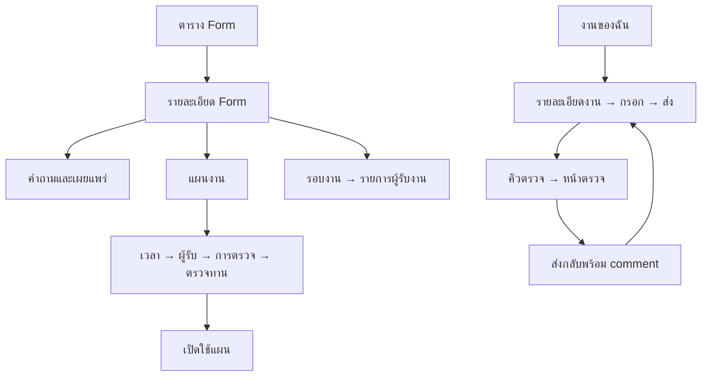

# Forms — UI flow และ frontend data flow

อ้างอิงโครงสร้างล่าสุด: [ERD (DBML)](../erDiagram.dbml) และ [คำอธิบาย ERD ภาษาไทย](erd-description-th.md) — แบบเสนอ ยังไม่ใช่ runtime schema

สถานะ: **Proposed — 2026-09-15** ยังไม่ได้ implement UI/API อ่านกติกาหลักที่ [feature design](form-workflow-design.md) และลำดับงานที่ [development plan](form-workflow-development-plan.md)

## 1. Navigation: ตาราง → หน้ารายละเอียด

คงกลุ่มเมนู Forms เดิม ไม่กระจายการตั้งค่าแผน/Role ไปเมนูระดับบนใหม่ ภายในกลุ่มมี “แบบฟอร์ม”, “งานของฉัน” และ “รอตรวจ” ตามสิทธิ์ การตั้ง Role permissions อยู่หน้าจัดการสิทธิ์เดิม ไม่ทำ permission matrix ซ้ำใน Form

Routes ต่อไปนี้เป็นข้อเสนอ โดยต่อจาก /company/forms/templates ที่มีอยู่จริง:

| Route                                                    | หน้าที่                                         |
| -------------------------------------------------------- | ----------------------------------------------- |
| /company/forms/templates                                 | ตาราง Form                                      |
| /company/forms/templates/create                          | สร้างชื่อ/คำอธิบาย แล้ว redirect เข้ารายละเอียด |
| /company/forms/templates/[id]                            | รายละเอียด: ภาพรวม                              |
| /company/forms/templates/[id]/builder                    | คำถาม/Version ใช้ builder route เดิม            |
| /company/forms/templates/[id]/plans                      | ตารางแผนภายใต้ Form                             |
| /company/forms/templates/[id]/plans/new                  | สร้างแผน                                        |
| /company/forms/templates/[id]/plans/[planId]             | แก้แผน/ดูประวัติ                                |
| /company/forms/templates/[id]/occurrences                | ตารางรอบงาน                                     |
| /company/forms/templates/[id]/occurrences/[occurrenceId] | รายละเอียดรอบและตาราง Assignment                |
| /company/forms/templates/[id]/settings                   | ข้อมูลทั่วไป/เปิดปิด Form                       |
| /company/forms/tasks                                     | งานของฉันจาก Role และ member                    |
| /company/forms/assignments/[assignmentId]                | รายละเอียดงานและเริ่ม/ทำต่อ                     |
| /company/forms/submissions/[id]                          | กรอกหรือดูคำตอบ revision; ต่อจาก route เดิม     |
| /company/forms/reviews                                   | คิวตรวจ                                         |
| /company/forms/submissions/[id]/review                   | หน้าตรวจ                                        |

รายละเอียด Form ใช้ header ร่วม: breadcrumb “แบบฟอร์ม > ชื่อ Form”, ชื่อ, เปิด/ปิด, published version และ tabs “ภาพรวม / คำถาม / แผนงาน / รอบงาน / ตั้งค่า” ใช้ URL จริงเพื่อ refresh/deep link/back ได้

## 2. ตารางรายการ Form

- Columns: ชื่อ (ลิงก์หลัก), คำอธิบายย่อ, เปิดใช้งาน, published version/ยังไม่เผยแพร่, แก้ไขล่าสุด และเมนูเพิ่มเติม
- ค้นหาชื่อ, filter เปิดใช้งาน/สถานะเผยแพร่, server pagination และ sort; search/filter/page อยู่ URL
- ปุ่มหลัก “สร้างแบบฟอร์ม” ให้กรอกชื่อ/คำอธิบายสั้น ๆ แล้วไป detail/builder เมื่อสร้างสำเร็จ
- คลิกชื่อหรือปุ่ม “รายละเอียด” เปลี่ยนหน้า ไม่เปิด preview/edit modal เป็น flow หลัก; ชื่อเป็น anchor ใช้ keyboard/open new tab ได้
- เมนูเพิ่มเติมมีเฉพาะ action สั้น เช่น เปิดรายละเอียด/เปิดปิด ไม่มีฟอร์มตั้งค่าขนาดใหญ่ซ่อนใน dropdown
- Empty ครั้งแรก: “ยังไม่มีแบบฟอร์ม” และปุ่มสร้างตามสิทธิ์; filtered empty: “ไม่พบตามเงื่อนไข” พร้อมล้าง filter
- Loading ใช้ skeleton ตาราง, error แสดงข้อความและ retry โดยไม่เปลี่ยนเป็น empty state
- จำ search/page เมื่อกลับจาก detail; ไม่แสดง total จากจำนวนรายการในหน้าแทน total จริง

## 3. รายละเอียด Form และคำถาม

### ภาพรวม

แสดงชื่อ/คำอธิบาย, version ที่ใช้งาน, สถานะแผน, รอบล่าสุด และปุ่มขั้นถัดไปตามข้อมูล: ยังไม่มีคำถาม → “เพิ่มคำถาม”; มี draft → “ตรวจทานและเผยแพร่”; เผยแพร่แล้วไม่มีแผน → “สร้างแผนงาน” จำนวนต่าง ๆ มาจาก read model

### คำถาม

1. เปิด tab คำถาม โหลด version, sections และ fields
2. Sidebar เป็นสารบัญหมวด พร้อมเพิ่ม/เรียงหมวด พื้นที่หลักแสดงข้อในหมวด
3. เพิ่ม/แก้ field แบบ dialog สั้นได้: label, type, required, help text และ config ตามชนิด
4. IMAGE ระบุจำนวนภาพสูงสุดและคำแนะนำการถ่าย; preview เห็นตัวอย่างช่องแนบรูป ไม่อ้างว่าระบบตรวจความชัดอัตโนมัติ
5. Draft บันทึก/เรียงผ่าน mutations; แสดงกำลังบันทึกและบันทึกสำเร็จ ไม่ toast ทุก keystroke
6. Version เผยแพร่แล้วอ่านอย่างเดียว ปุ่ม “สร้างฉบับแก้ไข” clone เป็น draft แล้วแก้ได้
7. Preview → publish summary → ยืนยันเผยแพร่ ระบุว่าแผน latest ใช้ฉบับใหม่เฉพาะรอบถัดไป งานเดิมไม่เปลี่ยน
8. Draft ไม่ครบแสดง inline errors และ jump ไปข้อที่ผิด

### ตั้งค่า

แก้ชื่อ/คำอธิบายและเปิดปิด Form ในหน้านี้ การปิดแสดงผลกระทบ “หยุดเปิดรอบใหม่ งานเดิมยังอยู่” ก่อนยืนยัน; ไม่ใส่หน้ากำหนด reviewer พิเศษเพราะใช้ Role permissions

## 4. สร้างและแก้แผน: หน้าย่อยเต็มหน้า

ตารางแผนแสดงชื่อ, ความถี่เป็นภาษาคน, ผู้รับงานย่อ, review mode, เปิดใช้งาน, รอบถัดไปที่คำนวณได้ คลิกชื่อเข้า plan detail ไม่เปิด wizard ซ้อน modal

### ขั้น 1: เวลา

- เลือกครั้งเดียว / ทำซ้ำ / กำหนดหลายช่วง
- ทำซ้ำเลือกหน่วยและ interval; “รายไตรมาส” แปลงเป็นทุก 3 เดือนโดยไม่เพิ่มตารางเฉพาะ
- แสดง controls เฉพาะที่ใช้ เช่น weekday สำหรับสัปดาห์ วันที่/วันสุดท้ายสำหรับเดือน
- เขตเวลาแสดงชัดเจน ค่าเริ่มต้นใช้ tenant timezone ถ้ามี มิฉะนั้นให้เลือก ไม่ใช้ browser timezone แบบซ่อน
- กำหนดเปิด/กำหนดส่ง, start/end และ invalid-date policy
- หลายช่วงใช้ตารางแก้ไข เพิ่ม/ลบแถว วันที่เริ่ม/กำหนดส่ง พร้อม error รายแถว
- แสดง preview 5 รอบจาก server พร้อม timezone และเตือนรอบซ้อน

### ขั้น 2: ผู้รับงาน

- เลือกหลายรายการจาก tabs “ตำแหน่ง” และ “สมาชิก” มี search/pagination และเฉพาะบริษัทปัจจุบัน
- Role แต่ละรายการเลือก “ร่วมทำหนึ่งชุด” หรือ “สมาชิกแต่ละคนทำคนละชุด” ข้อความอธิบายอยู่ติดตัวเลือก
- Summary แสดงรายการที่เลือกและจำนวนผู้รับตัวอย่าง ณ ตอนนี้ พร้อมข้อความว่าจำนวนจริงจะยึดสมาชิกตอนเปิดรอบ
- Member ซ้ำจากหลาย Role/direct จะแจกส่วนตัวครั้งเดียว แต่ shared Role กับส่วนตัวเป็นคนละงาน แสดงผลตัวอย่างก่อนบันทึก
- Inactive target แสดงเหตุผล ไม่ให้เลือกใหม่

### ขั้น 3: การตรวจและกติกา

- เลือก ไม่ต้องตรวจ / ตรวจภาพรวม / ครบทุกหมวด / ครบทุกข้อ พร้อมคำอธิบายเงื่อนไขอนุมัติ
- แสดงข้อความ “ผู้ตรวจต้องมีสิทธิ์จาก Role ของบริษัท” และลิงก์หน้าสิทธิ์เดิมสำหรับผู้จัดการสิทธิ์
- ตั้งส่งล่าช้าได้หรือไม่ และเมื่อระบบเปิดรอบไม่ทันให้ข้าม/เปิดย้อนหลัง
- เลือก fixed published version หรือ latest at opening
- เตือนหากยังไม่มี Role ที่มี finalize permission เมื่อแผนต้องตรวจ; ไม่แต่งตั้งผู้ตรวจให้โดยอัตโนมัติ

### ขั้น 4: ตรวจทาน

แสดงชื่อ Form/version selection, ตารางเวลา, timezone, ผู้รับงาน, เงื่อนไขตรวจ และ preview รอบ ปุ่ม “บันทึกแบบยังไม่เปิดใช้” / “บันทึกและเปิดใช้” กลับไปแก้แต่ละขั้นโดยข้อมูลไม่หาย

แก้แผนแสดง “มีผลกับรอบที่ยังไม่เปิด” พร้อม affected preview; บันทึก successor config ผ่าน backend ผู้ใช้เห็นประวัติการเปลี่ยนแผน ไม่ต้องจัดการ version record เอง

Plan detail มีหยุด/เปิดอีกครั้งพร้อมผลกระทบ งานเก่าไม่ถูกยกเลิกตาม; action ยกเลิกรอบอยู่ที่รอบงานต่างหาก

## 5. รอบงานและการติดตาม

- Tab รอบงาน: filter แผน/ช่วงวันที่/สถานะที่คำนวณ, columns รอบ, เวลาเปิด/กำหนดส่ง, จำนวนงาน, ส่งแล้ว/รอตรวจ/แก้ไข, การเปิดล่าช้า
- คลิกรอบ: header แสดงเวลาและ policy ที่ใช้จริง ไม่อ่าน plan ปัจจุบันแทน; ตาราง Assignment แสดงประเภทผู้รับ ชื่อ สถานะ และเวลาส่ง
- คลิก Assignment ไปประวัติคำตอบ; manager ที่มี read permission ดูได้ แต่แก้แทนไม่ได้เพียงเพราะเป็น manager
- ปัญหาเปิดรอบ เช่นไม่มีผู้รับ/ไม่มี version แสดงใน plan detail พร้อม retry หลังแก้สาเหตุ ใช้ operational job diagnostics ไม่สร้าง business success record ปลอม
- Cancel รอบหรือรายงานต้องใส่เหตุผลและยืนยันพร้อมจำนวนงานที่ได้รับผล; งานที่ยกเลิกดูประวัติได้แบบ read-only

## 6. งานของฉันและการกรอกภาพ

1. ตารางงานรวม personal และ shared roles มี filter สถานะ/กำหนดส่ง/Form และ badge ประเภทงาน
2. คลิกไป Assignment detail เห็นชื่อรอบ, due, ผู้รับ, version และประวัติ revisions
3. ปุ่ม “เริ่มทำ” ส่ง mutation แบบ idempotent แล้วนำทางไป draft ที่ server คืน ไม่สร้าง draft จากการเปิดหน้ารายการ
4. แบบกรอกแสดงสารบัญหมวด, required markers และ save state; มือถือเปลี่ยน sidebar เป็นรายการหมวดที่เปิดปิดได้
5. IMAGE มี “ถ่ายภาพ/เลือกรูป” ตามความสามารถ browser, thumbnails, upload progress, ลองใหม่/นำออก และขยายดูภาพ; capture เป็น hint ไม่รับประกัน native camera บนทุกอุปกรณ์
6. อัปโหลดพลาดยังเก็บ local draft ให้ retry; ห้ามกดส่งขณะมี upload pending/failed ที่ยังผูกกับคำตอบ
7. บันทึกคำตอบด้วย expected token; shared draft ชนกันให้ข้อความ “มีผู้แก้ไขข้อมูลแล้ว” พร้อมโหลดล่าสุดและให้ผู้ใช้เทียบ local changes ไม่เขียนทับเงียบ ๆ
8. ส่งแสดง summary ข้อที่ยังไม่ครบ และ focus ข้อแรก เมื่อผ่านให้ยืนยันส่ง; success ไปหน้าคำตอบ read-only
9. ถ้าถูกส่งกลับ แสดง banner “ต้องแก้ไข” พร้อม summary และรายการ comment คลิก jump ไปข้อ/หมวดได้
10. กด “แก้ไขและส่งใหม่” สร้าง successor; นำคำตอบเดิมมาไว้ให้ เปลี่ยนภาพโดยไม่ลบภาพ revision เก่า
11. มีตัวเลือกดูรอบก่อนเพื่อเทียบภาพ/comment กับรอบใหม่; ผลผ่านเดิมมีป้ายว่าของรอบก่อน
12. ถ้าหมดเวลาและไม่ให้ส่งล่าช้า แสดงเหตุผลและทางกลับไปติดต่อผู้จัดการ ไม่ปล่อยให้กรอกจบแล้วค่อยแจ้งครั้งแรก

## 7. หน้าตรวจ: ข้อ หมวด และทั้งชุด

### คิวตรวจ

ตารางเฉพาะงานที่ผู้ใช้มีสิทธิ์อ่าน Filter Form/รอบ/ผู้รับ/วันที่ส่ง; ปุ่ม “ตรวจ” ตาม permission ผู้มีเพียงสิทธิ์อ่านเปิดดูได้ แต่ไม่มี controls เปลี่ยนผล

### Layout

- Header: Form, ผู้รับงาน, รอบ, revision, เวลาส่ง และ review mode
- ซ้าย: สารบัญหมวดพร้อมจำนวนข้อที่ตรวจแล้วและจุดที่ต้องแก้
- กลาง: คำถาม/คำตอบ รูปขยายได้ และผลตรวจปัจจุบัน
- ขวาหรือแผงล่างบนมือถือ: summary จุดต้องแก้และคำตัดสินทั้งชุด
- ทุกภาพมีข้อความกำกับตามข้อ/ลำดับรูป; ผลตรวจไม่ใช้สีอย่างเดียว

### ตรวจรายข้อ

กด “ผ่าน” หรือ “ให้แก้ไข” → ให้แก้ไขเปิด note บังคับ → บันทึก → แสดงผู้ตรวจ/เวลา/comment ใต้ข้อ → ไปข้อถัดไป ผลนี้ยังไม่ส่งงานกลับ

### ตรวจ Section

หัวหมวดมี controls ตาม section permission ให้แก้ไขหมวดบังคับ note แสดง banner หมวด ไม่สร้าง reject entry ซ้ำทุกข้อ PASS หมวดไม่ล้าง NEEDS_CHANGES รายข้อ

### ตัดสินทั้งชุด

- แสดง summary ที่ยังต้องแก้และ coverage ที่ขาดตาม review mode
- “อนุมัติ” ใช้ได้เมื่อ policy ผ่าน; disabled อธิบายว่าเหลืออะไรและ jump ไปเป้าได้
- “ส่งกลับแก้ไข” บังคับ summary note แสดงรายการข้อ/หมวดที่ผู้กรอกจะเห็น แล้วกดยืนยัน
- คนไม่มี finalize permission บันทึกผลรายละเอียดได้ พร้อมข้อความว่ารอผู้มีสิทธิ์ตัดสิน ไม่แสดงปุ่มหลอก
- API เป็นผู้ตรวจเงื่อนไขสุดท้าย หากคนอื่น finalize ก่อนให้ reload เป็น read-only พร้อมผลจริง
- เปลี่ยนผลก่อน finalize เพิ่ม entry ใหม่แทนเก่า มีประวัติให้เปิดดู หลัง finalize ไม่มี edit

## 8. Frontend data ownership

ยึดโครงสร้างจริง apps/web/src/modules/form/{views,components,hooks} และ @repo/client; route page เป็นตัวเรียก view, ทุก view ใช้ PageLayout

- packages/ui เก็บ primitives; combined form/table/review panels อยู่ module form ไม่ย้าย business rules ไป ui
- แยก components ตาม template/plan/occurrence/assignment/fill/review และ hooks ตาม query/mutation เมื่อไฟล์ใหญ่
- ใช้ shared fields/table/overlay conventions เดิม; overlay component private และ export render functions ตามรูปแบบโมดูลที่เลือกใช้ ไม่สร้าง overlay framework ใหม่
- Server data อยู่ React Query; input draft อยู่ form state; filters อยู่ URL; ไม่คัดลอก server entities ไป global store อีกชุด
- Query key ต้องมี companyId และ filters/ids เช่น formKeys.plans(companyId, templateId, filters), assignment(companyId, id), review(companyId, submissionId)
- Tenant switch ยกเลิก in-flight requests, reset local draft/navigation ที่ข้าม tenant และใช้ query key ใหม่ ไม่แสดงผลบริษัทเดิมในหน้าใหม่
- Permission hints/available actions จาก server ใช้แสดง UI แต่ backend ตรวจซ้ำทุก mutation; ไม่ persist effective permissions
- Generated SDK errors ต้องถูกตรวจและ throw ผ่าน boundary helper ที่ใช้ร่วมกัน ห้าม fallback []/null เมื่อ HTTP error จนแสดงว่าไม่มีข้อมูล

### Mutation → invalidate

| Mutation                  | Queries ที่ต้อง refresh                                     |
| ------------------------- | ----------------------------------------------------------- |
| create/edit template      | list + detail                                               |
| edit/publish version      | detail + builder + plan version options/preview             |
| create/edit/activate plan | plan list/detail + schedule preview + template overview     |
| open/cancel occurrence    | occurrences + occurrence detail + tasks + relevant overview |
| start/clone/save/submit   | assignment + submission + tasks; submit เพิ่ม review queue  |
| review entry              | submission/review + review queue/coverage                   |
| finalize                  | review + assignment + tasks + occurrence summary + queue    |

อย่า invalidate ทุก Form ทั้งระบบ ถ้า server คืน canonical detail ใช้ setQueryData สำหรับรายการนั้นแล้ว invalidate aggregates ที่ได้รับผล ไม่ optimistic update การ publish/submit/finalize/cancel; reorder draft ใช้ optimistic ได้เมื่อ rollback ถูกต้อง

### Errors และ accessibility

- 400/validation แสดง inline ตาม field path; 401 ไป auth flow; 403 แสดงหมดสิทธิ์และหยุดแก้; 404 ไม่พบในขอบเขตที่เข้าถึง; 409 แสดง conflict พร้อมโหลดล่าสุด
- Network fail เก็บ input ไว้และ retry; dirty navigation เตือนก่อนออก ส่วนบันทึกสำเร็จไม่เตือนซ้ำ
- table headers, input labels, dialog titles, keyboard navigation/focus หลัง error และ status live region ต้องครบ
- Loading/error/empty/no permission เป็นคนละ state ทั้งหน้า list/detail; deep link refresh ต้องโหลดได้เอง

## 9. UX acceptance walkthrough

ผู้จัดการสร้าง Form จากตาราง → เข้า builder → publish → ตั้งรายวัน → เลือก Role ร่วมทำและสมาชิก A → preview → activate → เปิดรอบ → A เห็นงานส่วนตัวและงาน Role ถ้าเป็นสมาชิก → ส่งภาพ → ผู้มี permission ที่ไม่ใช่ Owner reject ภาพพร้อม note → finalize RETURN → A เห็นจุดแก้ ถ่ายใหม่ ส่ง revision ใหม่ → ผู้ตรวจ approve → ประวัติภาพเก่าและ comment ยังเปิดดูได้
