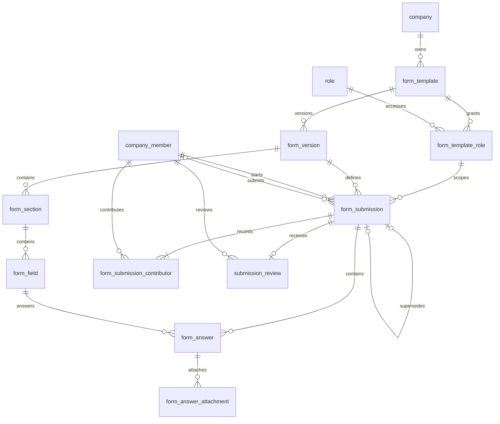

# Role-based Forms, Shared Responses & Owner Approval — MVP

สถานะ: **แบบเสนอ ปรับขอบเขตวันที่ 2026-09-09** ใน [`erDiagram.dbml`](../erDiagram.dbml) งานนี้แก้เฉพาะเอกสารและ proposed ERD ยังไม่เพิ่ม TypeScript, Drizzle schema, migration, API หรือ UI

## MVP ทำอะไรได้

**Owner สร้างและเผยแพร่ฟอร์มให้ Role → สมาชิก Role เดียวกันช่วยกรอกชุดคำตอบเดียว → สมาชิกคนใดคนหนึ่งส่ง → Owner อนุมัติทั้งชุด**

ผู้ใช้ยืนยันว่าหลายคนใน Role แม่บ้านร่วมกรอกใบของแม่บ้าน และหลายคนใน Role รปภ. ร่วมกรอกใบของ รปภ. แยกกัน หนึ่ง Role มีได้หลายฟอร์ม แต่ละฟอร์มแบ่งหลาย sections ได้ หากใช้ template เดียวกับหลาย Role แต่ละ submission ยังแยกตาม Role ไม่ร่วมกรอกข้าม Role และไม่สร้างใบแยกให้สมาชิกแต่ละคนโดยอัตโนมัติ

Form Builder เพิ่ม/แก้/เรียงหมวดและคำถาม กำหนด required และ preview ก่อน publish ได้ สมาชิกบันทึกแบบร่างร่วมกัน แนบภาพ/ไฟล์ แล้วส่งให้ Owner approve/reject พร้อมเหตุผลได้ ไม่มีระบบเชิญผู้ร่วมกรอกรายคน

**สมมติฐาน MVP: อนุมัติทั้ง submission ในขั้นเดียว** Section ใช้จัดหมวดเท่านั้น ไม่มีสถานะหรือผู้อนุมัติแยกราย section ทุกใบที่ส่งต้องผ่าน Owner จึงไม่ต้องมีตัวเลือก `requires_review`

## ข้อมูลที่เก็บ: 10 ตาราง

| ตาราง                         | หน้าที่                                                                                            |
| ----------------------------- | -------------------------------------------------------------------------------------------------- |
| `form_template`               | ตัวตนของฟอร์ม บริษัท ชื่อในรายการ และเปิด/ปิดการเริ่มใบใหม่                                        |
| `form_template_role`          | Role ที่เข้าถึงฟอร์มได้แบบ M:N; หนึ่ง Role มีหลายฟอร์ม และ template เดียวใช้หลาย Role ได้          |
| `form_version`                | ฉบับของฟอร์มพร้อมชื่อ/คำอธิบาย ณ ฉบับนั้น และ DRAFT/PUBLISHED/ARCHIVED                             |
| `form_section`                | หมวดและลำดับภายในฉบับ ไม่ใช่ขอบเขตอนุมัติหรือแบ่ง Role                                             |
| `form_field`                  | คำถาม ชนิด required ลำดับ และ config ขั้นต้น                                                       |
| `form_submission`             | ชุดคำตอบร่วมของ Role หนึ่งในบริษัทหนึ่ง ล็อกฉบับฟอร์ม แยกผู้เริ่ม/ผู้ส่ง และ revision กันบันทึกทับ |
| `form_submission_contributor` | รายชื่อสมาชิกที่เคยมีส่วนร่วม เพื่อกัน self-approval; ไม่ใช่ ACL และไม่เก็บประวัติค่าคำตอบทุกครั้ง |
| `form_answer`                 | คำตอบต่อ field พร้อมผู้แก้คำตอบล่าสุด                                                              |
| `form_answer_attachment`      | Metadata ภาพ/ไฟล์และผู้อัปโหลดจริง ไฟล์อยู่ Object Storage                                         |
| `submission_review`           | ผลตัดสินของ Owner หนึ่งรายการต่อ submission พร้อมผู้ตรวจ เวลา และเหตุผล                            |



เพิ่มเพียง 2 ตารางจาก MVP เดิม: สิทธิ์ฟอร์มตาม Role และรายชื่อผู้มีส่วนร่วม ไม่เพิ่ม task, invitation, realtime session หรือประวัติการแก้ไขเต็มรูปแบบ

Mermaid แสดง cardinality เชิงธุรกิจ: ผู้เริ่มต้องมีหนึ่งคน ส่วนผู้ส่งยังไม่มีได้ใน DRAFT; การมี contributor อย่างน้อยหนึ่งคนต้องสร้างพร้อม submission ใน use case เพราะ FK ไม่บังคับจำนวนแถวลูกขั้นต่ำ

## Flow และการรักษาประวัติ

1. **สร้างฟอร์ม:** Owner สร้าง template กับ version DRAFT เพิ่ม sections/fields และเลือก Role ที่ทำฟอร์มได้ใน `form_template_role` มี DRAFT ที่กำลังแก้ได้ไม่เกินหนึ่งฉบับต่อ template
2. **เผยแพร่:** ตรวจคำถาม/config และมี Role ที่เปิดสิทธิ์อย่างน้อยหนึ่งรายการ แล้ว publish ใน transaction เดียวกับการ archive ฉบับเผยแพร่เดิม มี PUBLISHED ได้ไม่เกินหนึ่งฉบับต่อ template ห้ามแก้ชื่อ/คำอธิบาย/sections/fields ของฉบับที่ publish แล้ว หากแก้ต้อง clone ฉบับใหม่และสร้าง UUID ใหม่ของ sections/fields
3. **เข้าชุดคำตอบร่วม:** สมาชิก active เห็นฟอร์มที่ Role ของตนมีสิทธิ์ เลือก DRAFT ของ Role เพื่อทำต่อใน submission เดิม เห็นคำตอบร่วมทุก section ไม่มีเจ้าของคำตอบเฉพาะคน เมื่อผู้ใช้ตั้งใจเริ่มชุดใหม่จึงสร้าง submission โดยล็อก version ปัจจุบันและ Role ปัจจุบัน บันทึก `started_by` และ contributor ของผู้เริ่มใน transaction เดียว
4. **ช่วยกรอกและส่ง:** สมาชิก active Role เดียวกันที่ผ่านสิทธิ์ฟอร์มแก้คำตอบ/แนบไฟล์ใน DRAFT ได้ทุก section และสมาชิกที่มีสิทธิ์คนใดก็ส่งทั้งชุดได้ ไม่จำกัดคนเริ่ม ก่อนส่งตรวจ required/type/options/ไฟล์สำเร็จและ revision ล่าสุด เก็บคนกดส่งจริงใน `submitted_by` แล้วเปลี่ยน `DRAFT → SUBMITTED`
5. **Owner ตรวจ:** `SUBMITTED → APPROVED / REJECTED` หลังส่งห้ามแก้ content/actor/contributor ของรอบนั้น Owner ที่ไม่มีส่วนร่วมตัดสินครั้งเดียวทั้งชุด; REJECT ต้องมีเหตุผล เขียน review และสถานะใน transaction เดียว
6. **แก้ไขส่งใหม่:** สมาชิก active Role เดิมที่ยังมีสิทธิ์ฟอร์มคนใดก็ clone ใบ REJECTED เป็น DRAFT ใหม่ ไม่จำกัดผู้เริ่มหรือผู้ส่งเดิม ใช้ version และ Role เดิม, `supersedes_submission_id` ชี้ใบเดิม, `revision = 1`, `submitted_by/submitted_at = NULL` และ `started_by` เป็นผู้เริ่มรอบใหม่ Clone answers/attachment metadata โดยคง actor เดิมจนมีการแก้จริง และ copy contributor ทุกคนจากรอบเดิมพร้อมเพิ่มผู้ clone ห้ามล้างรายชื่อผู้มีส่วนร่วม Unique successor กับ lock ใบเดิมกันการสร้างรอบแก้ไขซ้ำ ประวัติเดิมคงอยู่

ข้อเสนอพฤติกรรม MVP: หน้าฟอร์มแสดงรายการชุดคำตอบของ Role ให้เลือกทำต่อ และแยกปุ่ม “เริ่มชุดใหม่” อย่างชัดเจน หนึ่ง Role/form มีหลายชุดตามการใช้งานจริงได้ ไม่บังคับหนึ่งใบถาวรหรือหนึ่งใบต่อคน และไม่เพิ่มรอบเวลา/ตารางงานเพื่อจัดกลุ่มโดยอัตโนมัติ

การ publish ฉบับใหม่ไม่ย้าย version ของชุดที่เริ่มแล้ว รวมถึงรอบแก้ไขหลัง reject ซึ่งใช้ฉบับเดิมแม้ ARCHIVED การปิด template หยุดเริ่มชุดใหม่ แต่ชุดเดิมยังทำต่อได้หาก Role access ยังเปิด ชื่อบนใบคำตอบอ่านจาก version ไม่เปลี่ยนตามชื่อ template

## Role access และผู้ดำเนินการ

สมาชิกใช้ `company_member.roleId` ปัจจุบัน **เทียบ role ID จริง** ไม่เทียบชื่อหรือ `roleType` เพราะ Role แม่บ้านกับ รปภ. อาจมี roleType เป็น MEMBER เหมือนกัน Schema ปัจจุบันมี roleId เดียวต่อ membership; ไม่เพิ่มระบบตำแหน่งหรือหลาย Role ต่อสมาชิก

ข้อจำกัดฐานเดิม: `(company_id, user_id)` ยังไม่เป็น unique constraint แม้ use case ตรวจซ้ำก่อนสร้าง จึงห้ามถือว่าการค้นพบ membership หนึ่งแถวพิสูจน์ว่าไม่มีแถวอื่น หากพบ active membership ซ้ำของผู้ใช้ในบริษัทเดียวกันต้องปฏิเสธการตัดสิน Role ที่กำกวมและแก้ข้อมูลก่อน ไม่เลือก Role จากแถวแรกโดยพลการ

`form_template_role` เป็นรายการอนุญาต: Owner เลือกได้เฉพาะ Role บริษัทเดียวกัน หรือ system default (`company_id IS NULL`, `is_system_default = true`) ที่ระบบเดิมใช้ได้; ไม่ให้ SUPER_ADMIN เป็นกลุ่มผู้กรอก ไม่มีรายการที่ enabled หมายถึงสมาชิกไม่มีสิทธิ์ทำฟอร์ม ไม่ได้หมายถึงเปิดทุก Role เงื่อนไขบริษัทของ Role ต้องตรวจใน use case เพราะ FK role_id อย่างเดียวไม่บังคับ tenant

`form_submission.role_id` เป็นขอบเขตของชุดคำตอบและแก้ไม่ได้ สมาชิกต้อง active อยู่บริษัทเดียวกัน มี roleId ตรงชุดคำตอบ และยังมี form-template-role access ที่ enabled เพื่ออ่าน แก้ DRAFT หรือส่ง สมาชิกที่เปลี่ยน Role/ถูก deactivate จะเสียสิทธิ์เดิมทันที; สมาชิกใหม่ใน Role เดียวกันเข้าช่วยได้ตามสิทธิ์นี้ เป็น access ระดับ Role ภายในบริษัท ไม่เพิ่มขอบเขตแยกสาขาใน MVP

Owner มีสิทธิ์อ่าน/ตรวจทั้งบริษัท แต่ไม่ใช้สิทธิ์ Owner ข้าม Role เพื่อแก้คำตอบ การปิด `form_template_role.is_enabled` หยุดการอ่าน/แก้/ส่งของสมาชิกกลุ่มนั้น รวมถึงชุดที่มีอยู่ โดย Owner ยังอ่านตรวจได้ ใช้ปิดสิทธิ์แทนลบแถวที่มีประวัติ การแก้ ACL ต้องมีผลต่อ use case ครั้งถัดไปและ serialize กับ transaction ที่กำลังเขียนเพื่อไม่ให้ผ่านสิทธิ์ที่เพิ่งถูกถอน

| ข้อมูล                                  | ความหมาย                                                                                |
| --------------------------------------- | --------------------------------------------------------------------------------------- |
| `form_submission.started_by`            | ผู้เริ่มชุดคำตอบหรือรอบแก้ไข ไม่ใช่ผู้มีสิทธิ์กรอกเพียงคนเดียว                          |
| `form_submission.submitted_by`          | ผู้กดส่งจริง ตั้งเมื่อ submit เท่านั้น ไม่ใช่ผู้เขียนทุกคำตอบ                           |
| `form_answer.updated_by`                | ผู้แก้ค่าคำตอบหรือรายการไฟล์ของ field ล่าสุด ตั้งจาก session ของ actor                  |
| `form_answer_attachment.uploaded_by`    | ผู้อัปโหลด object จริง; clone metadata ไม่เปลี่ยนเป็นผู้ clone/ผู้ส่ง                   |
| `form_submission_contributor.member_id` | สมาชิกทุกคนที่เคยเริ่ม/แก้/ลบคำตอบหรือไฟล์/ส่งชุดนี้ รวมผู้มีส่วนร่วมที่สืบมาจากรอบก่อน |

Contributor เพิ่มครั้งแรกด้วย upsert ใน transaction เดียวกับการทำรายการ ไม่ลบแม้คำตอบถูกคนอื่นแก้ทับ ถูกเคลียร์ หรือสมาชิกย้าย Role เก็บเพียงรายชื่อ ไม่เก็บทุกค่าที่เปลี่ยนและไม่ใช้รายชื่อนี้ให้สิทธิ์กรอก ผู้เปิดอ่านอย่างเดียวไม่นับเป็น contributor; คนที่ยังไม่เคยเขียนก็ช่วยกรอกได้ถ้า Role ตรงและมี access

## ป้องกันการบันทึกทับและส่งระหว่างมีคนแก้

ใช้ optimistic concurrency ที่ระดับ submission เพียงจุดเดียว: client อ่าน `revision` แล้วส่ง `expected_revision` พร้อม patch เฉพาะคำตอบ/รายการไฟล์ที่ต้องการเปลี่ยน Server ตรวจสิทธิ์ปัจจุบันและทำ transaction ที่ lock submission, ตรวจว่า status ยัง DRAFT และ revision ตรง แล้วจึงแก้ข้อมูล/actor/contributor และเพิ่ม revision ทีเดียว ทั้งหมดสำเร็จหรือ rollback พร้อมกัน

การอ่านชุดคำตอบต้องคืน revision, answers และ attachments จาก snapshot เดียวกัน เช่น read-only REPEATABLE READ transaction ไม่อ่าน revision ใหม่ปนกับคำตอบเก่า การแก้/ส่งตรวจ membership, Role และ ACL ภายใน transaction โดยถือ lock ของข้อมูลสิทธิ์ที่ใช้ตัดสินจน commit; การเปลี่ยนสิทธิ์ใช้ลำดับ lock เดียวกันเพื่อให้การถอนสิทธิ์กับการเขียนมีลำดับชัดเจน

หาก A กับ B อ่าน revision 5 แล้ว A บันทึกสำเร็จเป็น 6 การบันทึกของ B ด้วย 5 ต้องคืน conflict โดยไม่เขียนทับ B โหลดข้อมูลล่าสุด ตรวจและส่งใหม่ ห้าม retry อัตโนมัติด้วย revision ใหม่จากเนื้อหาเก่า ข้อแลกเปลี่ยนคือแม้แก้คนละ field ก็อาจ conflict ซึ่งยอมรับเพื่อให้ MVP เรียบง่าย ไม่เพิ่ม per-field merge

Submit ต้องส่ง expected_revision เช่นกัน ตรวจชุดล่าสุดครบแล้วจึงตั้ง submitted_by/status และเพิ่ม revision ใน transaction เดียว ผู้ส่งต้องเห็นคำตอบล่าสุดก่อนส่ง ถ้าคนอื่นแก้ก่อนจะเกิด conflict; ถ้า submit สำเร็จก่อน การบันทึกที่ตามมาต้องถูกปฏิเสธเพราะไม่ใช่ DRAFT การแนบ/ลบไฟล์ต้องผ่านกฎเดียวกัน แม้ upload ไป Object Storage เริ่มก่อนส่ง ก็ห้ามผูก metadata ที่มาช้าหลัง submit และจัดการไฟล์ชั่วคราวที่ไม่ถูกอ้างแยกจากหลักฐาน

Review ใช้ expected_revision และ lock submission เช่นกันเพื่อตรวจ SUBMITTED, contributor และสิทธิ์ Owner ก่อนเขียน review/status พร้อมเพิ่ม revision ไม่มี autosave แบบ realtime, presence, การล็อกผู้แก้ราย section หรือ edit history เต็มรูปแบบ

## ชนิดคำถามที่พอสำหรับ MVP

| ชนิด            | รูปแบบคำตอบ / การใช้                                                                |
| --------------- | ----------------------------------------------------------------------------------- |
| `TEXT`          | string; config `multiline` สำหรับคำอธิบายหลายบรรทัด                                 |
| `NUMBER`        | number; config `unit` เป็นหน่วยแสดงผล เช่น °C                                       |
| `SELECT`        | เลือกค่าเดียวจาก config `options: [{value, label}]` เช่น ผ่าน/ไม่ผ่าน/ไม่เกี่ยวข้อง |
| `BOOLEAN`       | true/false สำหรับเช็กลิสต์หรือคำถามใช่/ไม่ใช่ ต้องแยก “ยังไม่ตอบ” จาก false         |
| `DATE`          | string วันที่ `YYYY-MM-DD`                                                          |
| `IMAGE`, `FILE` | เก็บใน attachment rows; `value` เป็น SQL NULL                                       |

รวม 7 ชนิด ลด TEXTAREA/RADIO/CHECKBOX ที่มีหน้าที่ซ้ำ ใช้ TEXT แบบหลายบรรทัด, SELECT และ BOOLEAN แทน ส่วน multi-select, TIME, SIGNATURE, scoring และการตั้งค่า validation ขั้นสูงเลื่อนออกก่อน

`config`/`value` ยังใช้ JSONB แต่ตรวจรูปแบบตามชนิดด้วย Zod ตัวเลือก SELECT ต้องมี value ไม่ซ้ำและคำตอบต้องตรงตัวเลือกจริง ค่า `0` และ `false` ถือว่าตอบแล้ว ไม่มี answer/SQL NULL คือยังไม่ตอบสำหรับชนิดทั่วไป Required แบบไฟล์ต้องมี attachment สำเร็จอย่างน้อยหนึ่งรายการ; limits จำนวน/ขนาด/MIME และความยาวข้อความใช้ค่ากลางฝั่ง server ยังไม่เปิดเป็นตัวเลือกต่อ field

เก็บเฉพาะ metadata และ immutable storage key ของไฟล์ ไม่เก็บ signed URL ก่อนอ่าน/ดาวน์โหลดต้องตรวจสิทธิ์ใบคำตอบ การส่งใหม่ใช้ object เดิมผ่าน metadata สำเนาได้; ลบ object ได้ต่อเมื่อไม่มีใบใดอ้างอยู่ เพื่อไม่ทำลายหลักฐานเก่า

## Owner และสิทธิ์ในบริษัท

ตรวจจากโค้ดปัจจุบัน: [`roleSchema`](../src/schema/permission.ts) มี `roleType = OWNER`; [`companyMemberSchema`](../src/schema/company.ts) ผูก `userId`, `companyId`, `roleId` และ `isActive` และ [CompanyMember use cases](../../applications/src/use-cases/company/company-member.usecase.ts) ใช้ `role.roleType` เพื่อตรวจ Owner โดยไม่อาศัยชื่อ Role

**Owner ผู้อนุมัติคือสมาชิก active ของบริษัทใบคำตอบ ซึ่ง Role ที่สมาชิกอ้างมี `role_type = OWNER` ณ เวลาตัดสิน** Role ต้องอยู่บริษัทเดียวกัน หรือเป็น system default ที่ `company_id IS NULL` ซึ่งระบบเดิมมี [seed Owner ส่วนกลาง](../../database/drizzle/20260831082653_seed_auth_permissions/migration.sql) อยู่แล้ว ไม่บังคับว่าทุก Owner role ต้องมี company_id และไม่ตีความ `created_by` ว่าเป็น Owner หรือผู้มีสิทธิ์อนุมัติ

ขอบเขตสิทธิ์ที่เสนอสำหรับ MVP:

- Owner สร้าง/เผยแพร่/ปิดฟอร์ม ตั้ง Role access ดูคำตอบในบริษัท และ approve/reject ทั้งใบ สมาชิกอ่าน/ร่วมแก้/ส่งและดูผลชุดของ Role ตามเงื่อนไขข้างต้น ไม่ข้ามไปชุดของ Role อื่น
- ใช้ company และ user จาก session ที่ตรวจแล้ว ตรวจ active user/company/membership และบริษัทของ resource จริงในทุก use case; `started_by`, `submitted_by`, `updated_by`, `created_by`, `published_by`, `uploaded_by`, `reviewed_by` รับจาก actor ที่ตรวจแล้ว ไม่เชื่อค่าจาก client
- ใช้ Feature/RBAC เดิม กำหนด action สำหรับการจัดการฟอร์ม กรอก ดูคำตอบ และ review ตอน implement โดยไม่เพิ่มตารางสิทธิ์ใหม่ สิทธิ์ review ต้องผ่านเงื่อนไข Owner เพิ่มจาก action permission
- [PermissionGuard ปัจจุบัน](../../applications/src/lib/guard.ts) มี `isAdmin` bypass จึงต้องตรวจ active membership/Owner/company ใน review use case โดยตรงด้วย Super Admin ไม่ถือเป็น Owner ของบริษัทอัตโนมัติ
- ห้าม Owner approve/reject หากเคยเป็นผู้เริ่ม ผู้กดส่ง หรือ contributor ของชุดนั้นและสาย revision ก่อนหน้า ตรวจตัวตน `userId` ผ่าน company_member ไม่ใช่แค่ member ID/Role ปัจจุบัน การไม่ใช่คนกดส่ง การย้าย Role การถูกเขียนทับคำตอบ หรือ resubmit ไม่ทำให้อนุมัติผลงานตนเองได้ ต้องใช้ Owner ที่ไม่เกี่ยวข้อง; หากไม่มีให้คงรออนุมัติ ไม่เพิ่มผู้อนุมัติสำรองหรือข้อยกเว้นอัตโนมัติ

ไม่สมมติว่าบริษัทมี Owner เพียงคนเดียว และไม่สร้าง owner_id ใหม่ใน template ผู้สร้างฟอร์มเป็นข้อมูลผู้ดำเนินการในอดีต สิทธิ์ตรวจใช้ membership/role ปัจจุบัน

## ข้อกำหนดที่เหลือในฐานข้อมูล

- ทุกตารางใหม่มี `company_id`; composite FK กันการเชื่อมคนละบริษัทและ answer คนละ version กับ submission; submission ระบุ template/version/role โดย FK บังคับ version และ role access ให้ตรง template เดียวกัน และ successor คง version/role เดิม ส่วน tenant ของ role และ role ปัจจุบันของ actor ตรวจใน use case
- คงเฉพาะ proposed unique `(id, company_id)` บน `company_member` เพื่อรองรับ actor FK; ถอด proposed unique บน branch/role ที่ใช้เฉพาะ Inspection ออก ไม่เปลี่ยนตารางระบบเดิมอื่น
- Unique ป้องกัน form-role mapping, `(form_template_id, version)`, `(submission_id, field_id)`, `(submission_id, member_id)` ของ contributor, successor และ review ซ้ำ; `sort_order` เรียงด้วย `sort_order, id` ไม่ต้อง unique
- UUIDv7 และ `created_at`/`updated_at` ตาม BaseEntity; instant ใหม่ใช้ timestamptz โดยไม่เปลี่ยน timestamp ของตารางเดิม
- เพิ่ม partial unique เมื่อเขียน migration จริง เพราะ note ใน DBML ไม่สร้าง constraint นี้ให้:

```sql
CREATE UNIQUE INDEX form_version_one_draft_per_template
ON form_version (form_template_id) WHERE status = 'DRAFT';
CREATE UNIQUE INDEX form_version_one_published_per_template
ON form_version (form_template_id) WHERE status = 'PUBLISHED';
```

Publish/clone ต้อง lock template เพื่อจัดสรรเลข version และตรวจสถานะให้สอดคล้องกัน กฎ immutable content, latest revision, contributor tracking, Role access, Owner authorization และ validation เป็นหน้าที่ use case/transaction ไม่ได้เกิดขึ้นจาก FK หรือ DBML note เอง

ตัวอย่างขอบเขตการบังคับกฎ: FK ปฏิเสธ answer ที่อยู่คนละ version ได้ แต่ฐานข้อมูลตามแบบนี้เพียงอย่างเดียวยังรับ review ของ DRAFT หรือผู้ที่ไม่ใช่ Owner ได้ การเขียนผ่าน use case ที่ตรวจสถานะและสิทธิ์จึงเป็นข้อกำหนดของการ implement ไม่ใช่ความสามารถที่ DBML ทำให้แล้ว เช่นเดียวกับ revision ที่ CHECK บังคับแค่ค่าบวก ส่วน expected_revision ต้องตรวจในคำสั่งเขียนจริง

FK ใหม่ใช้ RESTRICT เพื่อรักษาประวัติ ใช้ปิด template/deactivate member แทนลบเมื่อมีประวัติ; draft ที่ไม่ถูกใช้งานลบลูกก่อนแม่ได้ การ hard-delete user/company/branch เดิมที่ cascade ถึง member จะถูก restrict หากมีข้อมูลฟอร์มอ้างสมาชิกนั้น ต้องรองรับกรณีนี้เมื่อ implement deletion flow

## สิ่งที่เลื่อนออก

ถอด `inspection_plan`, `inspection_schedule_rule`, `inspection_task`, `inspection_task_submission` และ enums/relationships ที่เกี่ยวข้องออกจาก proposed ERD รอบนี้ รวมถึง scheduler/recurrence, กำหนดส่ง/overdue, assignment/claim, target snapshots และ workflow งานตรวจ ฟอร์มเริ่มกรอกได้โดยตรง จึงไม่ต้องผ่านการสร้างงาน

ยังไม่ทำ Asset/Location, Issue/Defect, Work Order/Maintenance, multi-step หรือ section-level approval และรายงานข้ามเวอร์ชันแบบเทียบ field_key จึงถอด field_key ออกจาก field ก่อน รายการคำตอบและประวัติอนุมัติอ่านจาก 10 ตารางนี้ได้

เริ่มพัฒนา flow ทั้งเส้นด้วย 10 ตารางนี้: builder/publish/Role access → shared draft/submit → Owner review/resubmit ตามรูปแบบ schema-first Zod และ entity data container ใน Domain; business logic อยู่ Application Layer และ persistence อยู่ Infrastructure ตามแนวทางเดิม ใช้ DBML เป็นแบบออกแบบ ไม่ใช้ SQL export ของทั้งไฟล์เป็น migration ทับฐานข้อมูลเดิม
